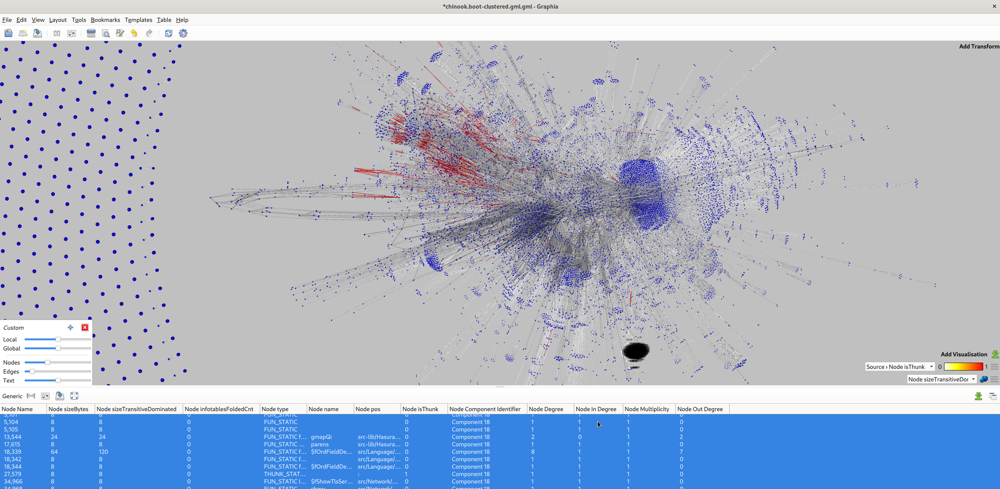

# ghc-debug analysis and dump routines, for Hasura

These have hard-coded defaults to work easily with 
[graphql-engine's ghc-debug instrumentation](https://github.com/hasura/graphql-engine/blob/724551b9ae87845594ef0408cff0e50eb6c90dc5/server/src-exec/Main.hs#L168-L180)
but should be easily adapted to any haskell program. Analysis passes should
work with any compatible dump.

## Usage

TODO (you'll need to read the code), but e.g. to take a snapshot:

    hasura-debug --take-snapshot

...to analyze and generate a closure graph (identical info table nodes folded
together):

    hasura-debug --analyze-snapshot ClusteredHeapGML 0 chinook.first_replace

The excellent program [graphia](https://github.com/graphia-app/graphia) can be
used to visually explore such a graph, and interactively filter, analyze etc.
Here, for instance we've just loaded a dump and styled edges from thunks as red:

